# 🧩 PyDriver — Project Architecture

**PyDriver** is an object-oriented framework built for the creation, maintenance, and execution of automated bots.  
It is designed to integrate multiple technologies — such as **Python, Selenium, MySQL, and external APIs** — in a modular, scalable, and maintainable structure.

Below is an overview of its main components and internal workflow.

---

## 🧱 Module Structure

PyDriver is organized into four main layers:

### ⚙️ Core
Responsible for the framework’s core execution.  
It manages automation loops, driver control, variable handling, and logging.  
Main files:
- `Loop.py` — controls the main loops (GeneralLoop, ConsultLoop)
- `Utils.py` — helper functions, logging, and error handling

---

### 🤖 Automations
Contains the Selenium-related modules:  
`Resources/automation/Proxy.py`, `ProxyOption.py`, `SeleniumDriver.py`, `SeleniumManager.py`, `SeleniumOptions.py`.

Each file represents a specific Selenium class with its own responsibilities.  
The most critical classes are:
- `SeleniumDriver.py`
- `SeleniumManager.py`
- `SeleniumOptions.py`

#### 🧩 Selenium Manager
Provides general-purpose methods for page interaction, such as:
- `select_element`
- `scroll_into_element`
- `check_loader_element`
- `check_alert`
- `send_keys_into_element`

#### 🌐 Selenium Driver
Used as an abstraction layer for `Selenoid` and `SeleniumGrid`.  
It inherits all methods from `SeleniumManager` and manages browser interactions.  
Also abstracts `SeleniumOptions`, defining launch configurations — for example, `load_image`, which can be disabled to increase performance.

---

### 🔗 Integrations
Handles external connections and integrations:
- `Api.py` / `ApiUser.py`: HTTP API consumption
- `MySql.py` / `MySqlConnection.py`: queries and data persistence using MySQL

---

### 🧩 Infrastructure
The runtime environment is containerized with **Docker**, allowing connections to **Selenium Grid** or **Selenoid**.  
Includes **VNC support** for remote automation visualization.  
Main files:
- `docker-compose.yml`
- `SeleniumGrid.py`
- `Selenoid.py`

---

## 📊 Architecture Diagram (Modules & Relations)

```mermaid
%%{init: {'theme': 'neutral'}}%%
flowchart TD
    U["🧑‍💻 User / CLI(CreateNewBot.py)"] --> Core["⚙️ Core(Loop.py, Utils.py)"]
    Core --> Manager["🧩 SeleniumManager(SeleniumManager.py)"]
    Manager --> Driver["🌐 SeleniumDriver(SeleniumDriver.py, SeleniumOptions.py)"]
    Manager --> Proxy["🕸️ Proxy / ProxyOption(Proxy.py, ProxyOption.py)"]
    Core --> Configs["🗂️ Configs(.env, settings)"]
    Core --> Logs["🪵 Utils / Logs(Tratamento de erros, registros)"]

    Automations["🤖 Automations / Bots(../*.py)"] --> Core
    Automations --> Integrations["🔗 Integrations(Api.py, ApiUser.py, MySql.py, MySqlConnection.py)"]
    Integrations --> DB["💾 MySQL Database"]
    Integrations --> ExternalAPI["🌍 External APIs"]

    Driver --> Grid["🧱 Selenium Grid / Selenoid(SeleniumGrid.py, Selenoid.py)"]
    Docker["🐳 Docker Compose / VNC"] -.-> Grid
    Docker -.-> Driver
```

---

## 🔁 Sequence Diagram (Execution Flow)

---

## 🧠 Overview

1. **Initialization:** the user creates a bot using `CreateNewBot.py`, which starts the `GeneralLoop`.  
2. **Management:** `SeleniumManager` initializes the driver and sets up browser options (with or without Grid).  
3. **Execution:** the bot performs automated actions (login, scraping, form submission, etc.), controlled by loops.  
4. **Integration:** results are stored in MySQL or sent through an API.  
5. **Finalization:** once loops end, the driver is closed and logs are written by the `Utils` module.

---

## 🧾 Summary

**PyDriver** is designed to be **modular, extensible, and automation-friendly**, enabling centralized creation and management of multiple bots.  
Its `core` acts as the orchestration layer, while the automation and integration modules make it adaptable for use cases ranging from simple data extraction to complex automation workflows.
