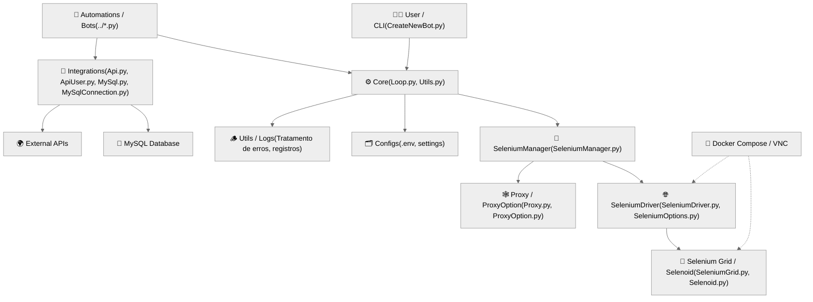
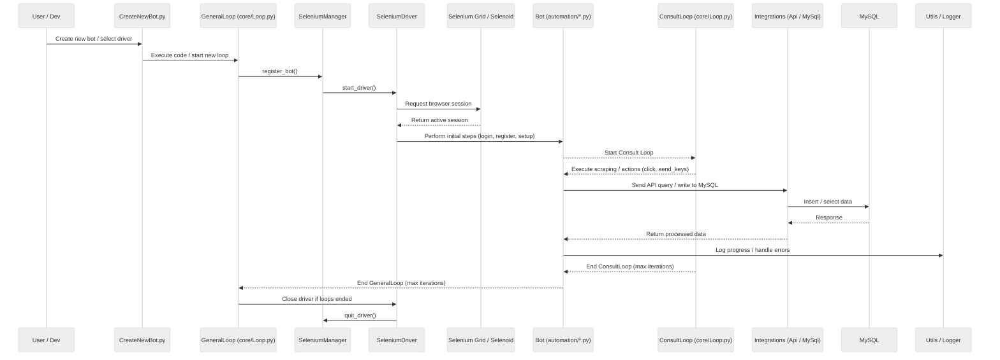

# 🧩 PyDriver — Arquitetura do Projeto

O **PyDriver** é um framework orientado a objetos desenvolvido para criação, manutenção e execução de robôs automatizados.  
Ele foi projetado para integrar diferentes tecnologias — como **Python, Selenium, MySQL e APIs externas** — em uma estrutura modular, escalável e de fácil manutenção.

A seguir, são apresentados os principais componentes e o fluxo de funcionamento interno do projeto.

---

## 🧱 Estrutura de Módulos

O PyDriver é dividido em quatro principais camadas:

### ⚙️ Core
Responsável pelo núcleo de execução do framework.  
Gerencia os *loops* de automação, o controle de drivers, a manipulação de variáveis e os logs.  
Arquivos principais:
- `Loop.py` — controla os loops principais (GeneralLoop, ConsultLoop)
- `Utils.py` — funções auxiliares, geração de logs e tratamento de erros

---

### 🤖 Automations
Contém as dependências diretas do Selenium:  
`Resources/automation/Proxy.py`, `ProxyOption.py`, `SeleniumDriver.py`, `SeleniumManager.py`, `SeleniumOptions.py`.

Cada arquivo representa uma classe responsável por uma funcionalidade específica do Selenium.  
As classes mais importantes e indispensáveis são:
- `SeleniumDriver.py`
- `SeleniumManager.py`
- `SeleniumOptions.py`

Nelas, estão os métodos principais responsáveis pela execução.

#### 🧩 Selenium Manager
Métodos gerais para interação com páginas web, como:
- `select_element`
- `scroll_into_element`
- `check_loader_element`
- `check_alert`
- `send_keys_into_element`

#### 🌐 Selenium Driver
Utilizada como classe de abstração para `Selenoid` e `SeleniumGrid`.  
Ela herda todos os métodos da classe `SeleniumManager`, centralizando a comunicação com o navegador.  
Também abstrai a classe `SeleniumOptions`, usada para definir as configurações de inicialização do Selenium — por exemplo, `load_image`, que permite desativar o carregamento de imagens e tornar as execuções mais rápidas.

---

### 🔗 Integrations
Gerencia conexões e integrações externas:
- `Api.py` / `ApiUser.py`: consumo de APIs HTTP
- `MySql.py` / `MySqlConnection.py`: consultas e persistência em banco de dados MySQL

---

### 🧩 Infraestrutura
O ambiente de execução é containerizado com **Docker**, e o PyDriver pode se conectar a **Selenium Grid** ou **Selenoid**.  
Inclui suporte a **VNC**, permitindo a visualização remota das automações.  
Arquivos principais:
- `docker-compose.yml`
- `SeleniumGrid.py`
- `Selenoid.py`

---

## 📊 Diagrama de Arquitetura (Módulos e Relações)

## 🧠 Visão geral

1. **Inicialização:** o usuário cria um bot usando `CreateNewBot.py`, que ao executar o script, inicia o `GeneralLoop`.
2. **Gerenciamento:** `SeleniumManager` inicializa o driver e configura as opções do navegador (com ou sem Grid).
3. **Execução:** o bot executa ações automatizadas (login, scraping, envio de formulário, etc.), controladas por loops.
4. **Integração:** os resultados são armazenados no MySQL ou enviados por meio de uma API.
5. **Finalização:** assim que os loops terminam, o driver é fechado e os logs são gravados pelo módulo `Utils`.

---

## 🧾 Resumo

O **PyDriver** foi projetado para ser **modular, extensível e amigável à automação**, permitindo a criação e o gerenciamento centralizados de múltiplos bots.
Seu `núcleo` atua como a camada de orquestração, enquanto os módulos de automação e integração o tornam adaptável para casos de uso que vão desde simples extração de dados até fluxos de trabalho de automação complexos.